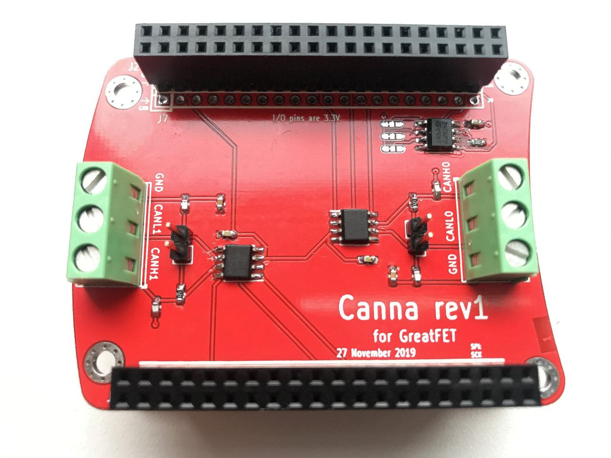

# Canna - a CAN access neighbor
## for GreatFET
### PCB info

- CAN0_TD: P3_2
- CAN0_RD: P3_1
- CAN0_STB: P2_11

- CAN1_TD: P1_17
- CAN1_RD: P1_18
- CAN1_STB: P1_0

### Canna rev1 assembled PCB

### ToDo list
- [ ] Make Canna more neighborly by changing CAN transceiver control from direct GPIO to an I2C expander (with at least 6 controllable digital I/Os)
- [ ] Remove the EEPROM as it is not needed
- [ ] Make PCB modular, so that CAN transceivers can be swapped out e.g. by placing them on pluggable daughter boards
- [ ] Find a Canna image (outline?) suitable for use as silkscreen PCB art
